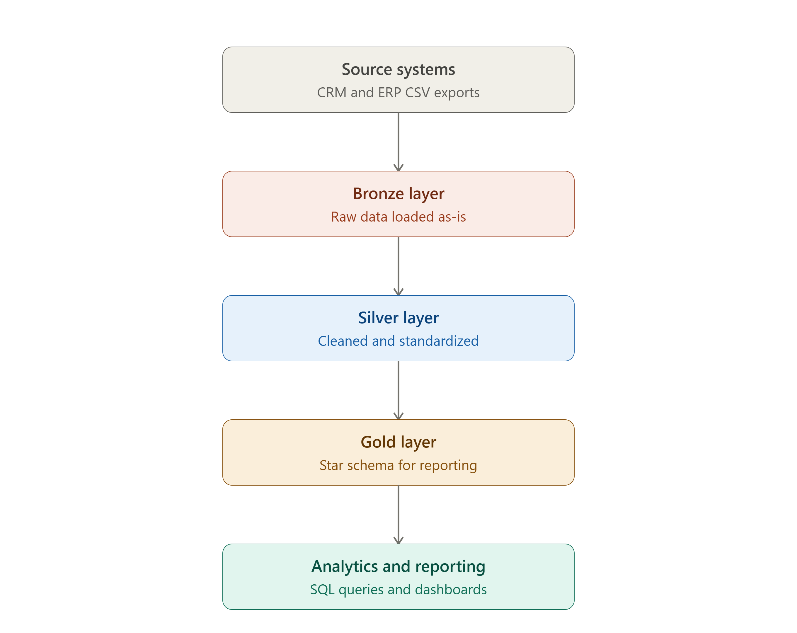
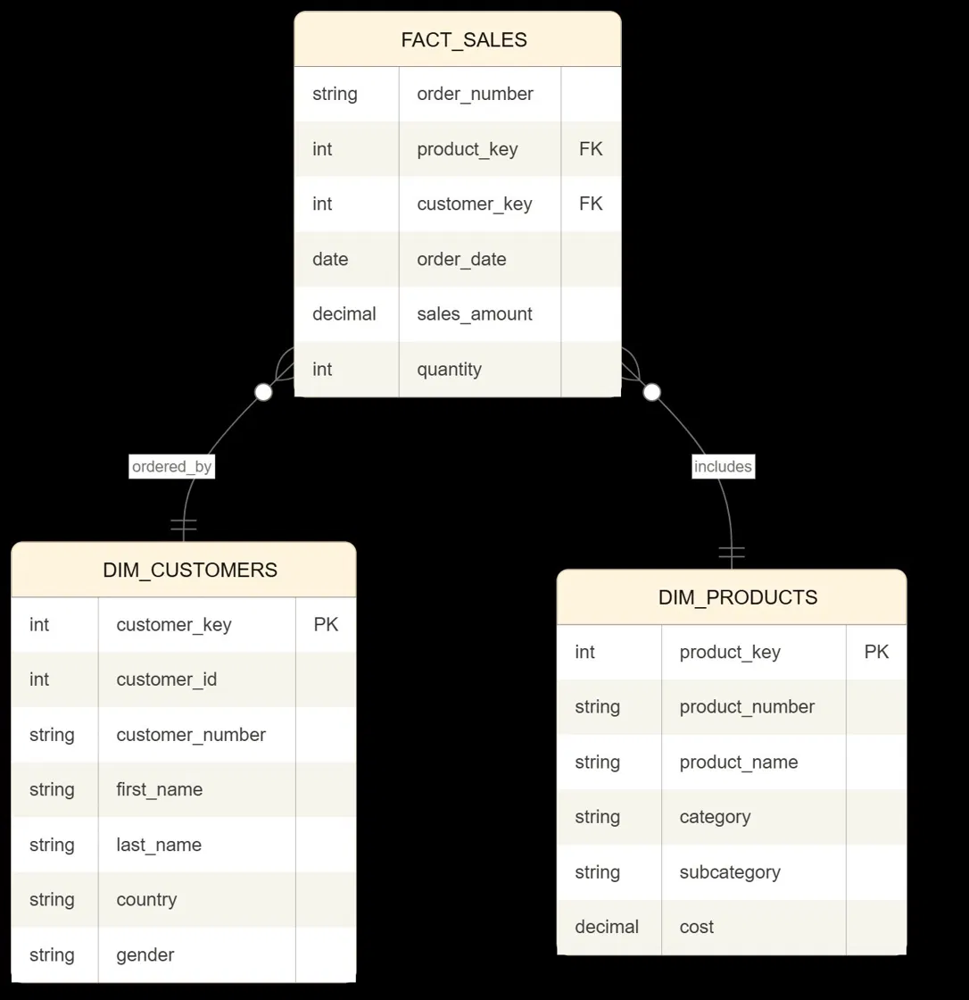

# SQL Data Warehouse & Analytics

[](https://www.microsoft.com/en-us/sql-server)
[](https://learn.microsoft.com/en-us/sql/t-sql/language-reference)
[-F2A623?style=flat-square)]()

An end-to-end SQL data analytics project covering the full data lifecycle - from raw, multi-source data ingestion to a clean, production-style **data warehouse**, through to an **SQL analytics and business reporting layer** built on top of it.

The repository is organized into two connected components that together tell one story: **build the warehouse, then use it to answer business questions.**

```
sql-data-warehouse-analytics/
├── data-warehouse/    Part 1 - ETL pipeline + Medallion Architecture (Bronze → Silver → Gold)
└── data-analytics/    Part 2 - Exploratory & business analytics on the Gold layer
```

---

## Table of Contents

- [Project Overview](#project-overview)
- [Architecture](#architecture)
- [Repository Structure](#repository-structure)
- [Part 1 - Data Warehouse](#part-1--data-warehouse)
- [Part 2 - Data Analytics](#part-2--data-analytics)
- [Data Model: Star Schema](#data-model-star-schema)
- [Key Business Questions Answered](#key-business-questions-answered)
- [Tech Stack](#tech-stack)
- [How to Run](#how-to-run)
- [Data Quality & Testing](#data-quality--testing)
- [Skills Demonstrated](#skills-demonstrated)
- [Future Enhancements](#future-enhancements)
- [Author](#author)

---

## Project Overview

**Objective:** Consolidate raw sales data from two independent source systems (CRM and ERP) into a single, analytics-ready data warehouse using SQL Server, then build a structured layer of SQL-based analytics to deliver actionable insights on customer behavior, product performance, and sales trends.

| | |
|---|---|
| **Domain** | Sales / Retail Analytics |
| **Database** | SQL Server (T-SQL) |
| **Architecture** | Medallion (Bronze → Silver → Gold) |
| **Scope** | Data Engineering (ETL + Data Modeling) and Data Analysis (SQL Reporting) |

This project demonstrates the complete workflow a Data Analyst or BI Analyst is expected to support: understanding raw source data, working with engineers' data models, and writing the analytical SQL that turns clean data into business decisions.

---

## Architecture

The warehouse follows a **Medallion Architecture** with three progressive layers, moving raw data toward a business-ready model:



| Layer | Purpose |
|---|---|
| **Bronze** | Raw data loaded as-is from CRM and ERP CSV sources into staging tables - no transformations. Loaded via `BULK INSERT` through stored procedures with batch timing and error handling. |
| **Silver** | Data cleansing, standardization, deduplication, type casting, and normalization to resolve inconsistencies across the two source systems. |
| **Gold** | Business-ready **star schema** - `dim_customers`, `dim_products`, `fact_sales` - exposed as SQL views and optimized for analytical queries and reporting. |

---

## Repository Structure

```
sql-data-warehouse-analytics/
├── data-warehouse/
│   ├── datasets/
│   │   ├── source_crm/          Raw CRM exports (customers, products, sales)
│   │   └── source_erp/          Raw ERP exports (demographics, location, categories)
│   ├── docs/
│   │   ├── medallion_architecture_flow.png
│   │   ├── star_schema.png
│   │   ├── data_catalog.md      Field-level documentation for all Gold layer tables
│   │   └── naming_conventions.md
│   ├── scripts/
│   │   ├── init_database.sql
│   │   ├── bronze/               DDL + stored procedures for raw data ingestion
│   │   ├── silver/                DDL + stored procedures for cleaning & transformation
│   │   └── gold/                  Views for the final star schema
│   └── tests/                     Data quality checks (nulls, duplicates, referential integrity)
│
└── data-analytics/
    ├── datasets/
    │   └── gold-layer-exports/    CSV snapshots of dim_customers, dim_products, fact_sales
    └── scripts/                   14 SQL scripts (00 → 13)
```

---

## Part 1 - Data Warehouse

### Data Sources

Two independent source systems integrated into a single unified data model:

| Source | Tables | Contents |
|---|---|---|
| **CRM** | `crm_cust_info`, `crm_prd_info`, `crm_sales_details` | Customer master data, product master data, sales transactions |
| **ERP** | `erp_cust_az12`, `erp_loc_a101`, `erp_px_cat_g1v2` | Customer demographics, customer geography/location, product category metadata |

### ETL Approach

- **Bronze layer**: full-refresh ingestion of raw CSVs via `BULK INSERT`, wrapped in stored procedures with execution-time logging and error handling.
- **Silver layer**: standardizes inconsistent codes/formats across CRM and ERP (e.g. gender, country names, dates), removes duplicates, and applies business rules (e.g. resolving conflicting gender values between systems).
- **Gold layer**: SQL views implementing a star schema — surrogate keys generated via `ROW_NUMBER()`, dimension tables enriched by joining cleaned CRM and ERP attributes, and a fact table built by joining transaction data to both dimensions.

### Gold Layer Tables

- **`gold.dim_customers`** - Customer dimension enriched with demographic and geographic data: name, country, gender, marital status, birthdate, account creation date.
- **`gold.dim_products`** — Product dimension with category, subcategory, product line, cost, and maintenance attributes.
- **`gold.fact_sales`** — Sales fact table capturing order number, product key, customer key, order/ship/due dates, sales amount, quantity, and price.

---

## Part 2 — Data Analytics

A set of **14 progressively-built SQL scripts** that answer real business questions using the Gold layer — moving from schema exploration to reusable, production-style reporting views.

| Script | Analysis Type | Key Techniques |
|---|---|---|
| `00_init_database.sql` | Database setup | Schema initialization |
| `01_database_exploration.sql` | Schema discovery | `INFORMATION_SCHEMA`, metadata queries |
| `02_dimensions_exploration.sql` | Dimension profiling | Distinct values, null checks |
| `03_date_range_exploration.sql` | Temporal boundaries | `MIN()`, `MAX()`, `DATEDIFF()` |
| `04_measures_exploration.sql` | KPI baseline | Aggregations, averages, totals |
| `05_magnitude_analysis.sql` | Cross-dimension comparison | `GROUP BY`, sales by category/country |
| `06_ranking_analysis.sql` | Top/bottom N | `RANK()`, `DENSE_RANK()`, `TOP N` |
| `07_change_over_time_analysis.sql` | Trend analysis | Monthly/yearly sales trends, `DATETRUNC()` |
| `08_cumulative_analysis.sql` | Running totals | `SUM() OVER()`, `AVG() OVER()` — moving averages |
| `09_performance_analysis.sql` | Year-over-year comparison | `LAG()`, above/below average classification |
| `10_data_segmentation.sql` | Customer & product segmentation | `CASE`, VIP / Regular / New groups |
| `11_part_to_whole_analysis.sql` | Contribution analysis | Category share of total revenue |
| `12_report_customers.sql` | Customer reporting view | RFM-style KPIs — recency, AOV, monthly spend, age groups |
| `13_report_products.sql` | Product reporting view | Revenue segments, performance KPIs |

### Key Analytical Outputs

- **`gold.report_customers`** — A reusable view that segments customers into **VIP / Regular / New** based on lifespan and total spend, and computes age groups, recency (months since last order), average order value (AOV), and average monthly spend.
- **`gold.report_products`** — A reusable view capturing product-level revenue segments, order frequency, and performance KPIs for business reporting.

---

## Data Model: Star Schema

`fact_sales` connects to `dim_customers` and `dim_products` through surrogate keys, following the project's naming conventions (`_key` suffix for surrogate keys, `dim_` / `fact_` prefixes for dimension and fact tables).



---

## Key Business Questions Answered

This project's analytics layer is designed to answer the kinds of questions a sales or BI team would ask:

- Which product categories and subcategories generate the most revenue, and how concentrated is that revenue (part-to-whole analysis)?
- Who are the top-performing products and customers by sales, and which are underperforming?
- How does monthly revenue trend over time, and what does the 3-month moving average look like?
- Which customers qualify as **VIP** based on RFM-style segmentation, and what share of total revenue do they represent?
- How does each product's/category's performance compare year-over-year — above or below its historical average?
- What is the average order value (AOV) and average monthly spend by customer segment?

>### Key Findings


- Bikes dominate revenue at 96.5% of total sales ($28.3M out of $29.4M), while Accessories (2.4%) and Clothing (1.2%) contribute minimally - revealing a highly concentrated product portfolio with clear upsell opportunities in lower-performing categories.
- 2013 was the peak sales year, generating $16.3M in revenue across 17,427 customers - a 131% YoY growth over 2011 ($7.1M), driven by significant expansion in customer base and order volume.
- Sales declined sharply in 2014 ($45K, 834 customers), signaling either a mid-year data cutoff or a significant churn event - a critical insight for customer retention strategy.

---

## Tech Stack

| Tool | Purpose |
|---|---|
| **SQL Server (T-SQL)** | Data warehouse, ETL stored procedures, analytics queries |
| **SSMS** | Query execution and database management |
| **BULK INSERT** | High-performance CSV ingestion into the Bronze layer |
| **Draw.io** | Architecture, data flow, and data model diagrams |
| **Git / GitHub** | Version control and portfolio publishing |

---

## How to Run

### Prerequisites
- [SQL Server Express](https://www.microsoft.com/en-us/sql-server/sql-server-downloads) (free)
- [SQL Server Management Studio (SSMS)](https://learn.microsoft.com/en-us/sql/ssms/download-sql-server-management-studio-ssms)

### Part 1 — Build the Data Warehouse

```sql
-- Step 1: Initialize the database and schemas
:r data-warehouse/scripts/init_database.sql

-- Step 2: Load the Bronze layer (raw ingestion)
EXEC bronze.load_bronze;

-- Step 3: Load the Silver layer (clean & transform)
EXEC silver.load_silver;

-- Step 4: Create Gold layer views (star schema)
-- Run all scripts in data-warehouse/scripts/gold/

-- Step 5: Validate data quality
-- Run all scripts in data-warehouse/tests/
```

### Part 2 — Run the Analytics Layer

**Option A — Against the warehouse built in Part 1**
Run `data-analytics/scripts/00` through `13` in order against the Gold schema.

**Option B — Standalone (no warehouse required)**
Load `data-analytics/datasets/gold-layer-exports/*.csv` into a fresh database, then run the analytics scripts against those tables.

---

## Data Quality & Testing

The `data-warehouse/tests/` folder contains validation scripts run against the Silver and Gold layers, covering:

- Null and duplicate checks on primary/surrogate keys
- Referential integrity between fact and dimension tables
- Standardization checks (e.g. consistent country names, gender values, date formats)

---

## Skills Demonstrated

| Category | Skills |
|---|---|
| **Data Engineering / ETL** | ETL pipeline design, stored procedures, `BULK INSERT`, batch processing, error handling |
| **Data Architecture & Modeling** | Medallion Architecture (Bronze/Silver/Gold), star schema, dimensional modeling, surrogate keys |
| **Data Quality** | Null checks, duplicate detection, referential integrity testing, standardization validation |
| **SQL Analytics** | Window functions (`LAG`, `SUM() OVER`, `AVG() OVER`, `RANK`), CTEs, subqueries, `CASE` logic |
| **Business Analytics** | Customer segmentation, RFM analysis, year-over-year performance, trend analysis, part-to-whole analysis |
| **Documentation** | Data catalog, naming conventions, architecture diagrams, inline SQL documentation |

---

## Future Enhancements

- Build a Power BI / Tableau dashboard on top of `gold.report_customers` and `gold.report_products`
- Automate ETL execution with SQL Server Agent jobs or an orchestration tool (e.g. Airflow)
- Move from full-refresh to incremental loading in the Bronze and Silver layers
- Add CI checks that run the data quality tests automatically on push

---

## Author

**Mallareddygari Gayathri**

Data Analyst | SQL | Data Visualization | Business Analytics

[LinkedIn](https://www.linkedin.com/in/mallareddygari-gayathri/) • [GitHub](https://github.com/Gayathri-Reddy874)

